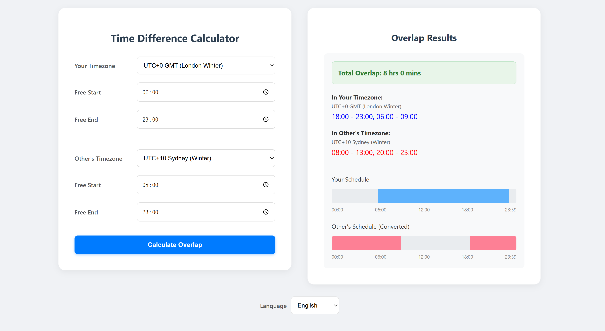

# Time Difference Calculator

People frequently travel or study abroad but still want to stay connected. This project helps users find shared free time, facilitating easier schedule coordination.

## Usage

Open 'index.html' in a web browser.  
You can change the language at the bottom of the page.  
Select your time zone and the other person's time zone. Input the start and end times for your availability. Finally, click "Calculate Overlap" to view the overlapping hours and time periods for both locations.  

Click [here](https://xiongedward2008.github.io/time-difference-calculator/) to view the demo.
